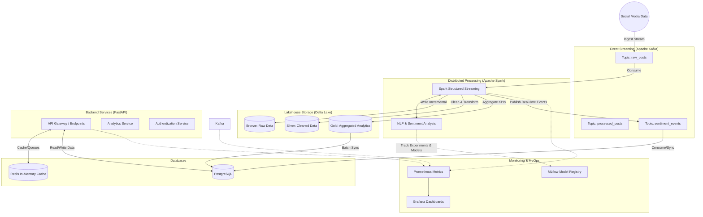

# Social Media Sentiment Lakehouse

An enterprise-grade, distributed social media sentiment lakehouse platform capable of ingesting streaming data, processing it in real-time, and serving scalable analytics.

## System Architecture



## Core Features

- **Real-Time Social Media Ingestion:** Event-driven pipelines using Apache Kafka.
- **Distributed Sentiment Processing:** Parallel execution and real-time sentiment scoring using PySpark Streaming and NLP models.
- **Lakehouse Architecture:** Delta Lake implementation with ACID compliance and Bronze/Silver/Gold data tiers.
- **Sentiment Analytics:** Dashboards, KPI generation, trend detection, and engagement analytics.
- **Machine Learning Workflows:** Model versioning, experiment tracking, and lifecycle management with MLflow.

## Tech Stack

- **Backend:** Python, FastAPI, AsyncIO, SQLAlchemy
- **Streaming:** Apache Kafka, Zookeeper
- **Processing:** Apache Spark, PySpark Streaming
- **Storage:** Delta Lake, PostgreSQL
- **Caching & Queues:** Redis, Celery
- **Machine Learning:** Scikit-learn, Hugging Face Transformers, NLTK, MLflow
- **Infrastructure:** Docker, Docker Compose
- **Observability:** Prometheus, Grafana

## Local Deployment Instructions

### Prerequisites
- Docker and Docker Compose
- Python 3.10+ (for local development)

### 1. Clone Repository

```bash
git clone <repository_url>
cd social-media-sentiment-lakehouse
```

### 2. Configure Environment

```bash
cp .env.example .env
```
Ensure the `.env` file is populated with appropriate secrets and configuration values.

### 3. Start Services

Bring up the entire distributed stack using Docker Compose:

```bash
docker-compose up --build -d
```

### 4. Run Database Migrations

Apply SQLAlchemy Alembic migrations to set up the PostgreSQL schemas:

```bash
docker-compose exec backend alembic upgrade head
```

### 5. Access Services

- **FastAPI Application:** `http://localhost:8000`
- **Swagger Documentation:** `http://localhost:8000/docs`
- **MLflow Tracking Server:** `http://localhost:5000`
- **Grafana Dashboards:** `http://localhost:3000`
- **Prometheus UI:** `http://localhost:9090`